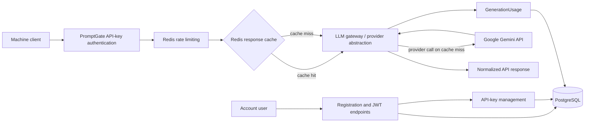

# PromptGate

[](https://github.com/ArvinPr/promptgate/actions/workflows/ci.yml)

PromptGate is a production-style LLM API gateway built with Django REST Framework. It adds authentication, rate limiting, caching, usage tracking, provider abstraction, and operational observability around LLM requests.

It is a portfolio project that demonstrates practical backend architecture and defensive integration patterns; it is not presented as a fully managed production service.

## Key features

- Email-based user registration and JWT authentication
- Hashed PromptGate client API keys with revocation support
- Google Gemini integration through the official `google-genai` SDK
- Provider-independent gateway and normalized response types
- Per-API-key Redis rate limiting
- Per-client Redis response caching
- Gateway-generated request IDs
- Token usage and provider latency tracking
- Safe metadata for successful, failed, and cached requests
- PostgreSQL persistence
- OpenAPI schema and Swagger UI
- Docker Compose development environment
- Automated pytest suite and GitHub Actions CI

## Architecture



Django REST Framework handles account, JWT, and API-key management. Generation requests use a separate PromptGate API key, pass through rate limiting and caching, and call Gemini only when there is no cache hit.

## Tech stack

| Area | Technology |
| --- | --- |
| Application | Python 3.13, Django 5.2 |
| API | Django REST Framework 3.16 |
| Authentication | Simple JWT and PromptGate API keys |
| Database | PostgreSQL 17 |
| Rate limiting and cache | Redis 7 |
| LLM provider | Google Gemini via `google-genai` |
| API schema | drf-spectacular |
| Tests | pytest and pytest-django |
| Runtime | Docker, Docker Compose, Gunicorn |
| CI | GitHub Actions |

Version ranges are defined in [requirements.txt](requirements.txt), while service image versions are defined in [docker-compose.yml](docker-compose.yml).

## Quick start

Requirements: Git, Docker, and Docker Compose.

```bash
git clone https://github.com/ArvinPr/promptgate.git
cd promptgate
cp .env.example .env
```

On Windows Command Prompt, use `copy .env.example .env` instead of `cp`.

Edit `.env`, replace the placeholder secrets, and set a valid server-side `GEMINI_API_KEY`. Never commit this file.

Build the image, apply migrations, and start the services:

```bash
docker compose build
docker compose run --rm web python manage.py migrate
docker compose up -d
```

Confirm that the API is running:

```bash
curl http://localhost:8000/api/health/
```

The response should be:

```json
{"status":"ok"}
```

Use `docker compose logs -f web` to inspect application logs and `docker compose down` to stop the stack.

## Environment variables

The committed [.env.example](.env.example) contains safe development placeholders and defaults.

| Variable | Purpose |
| --- | --- |
| `DEBUG` | Enables or disables Django debug mode. |
| `SECRET_KEY` | Django cryptographic signing key; replace the placeholder. |
| `ALLOWED_HOSTS` | Comma-separated hosts accepted by Django. |
| `DB_NAME` | PostgreSQL database name. |
| `DB_USER` | PostgreSQL user. |
| `DB_PASSWORD` | PostgreSQL password; replace the placeholder. |
| `DB_HOST` | PostgreSQL hostname. Docker Compose sets this to `postgres`. |
| `DB_PORT` | PostgreSQL port, normally `5432`. |
| `GEMINI_API_KEY` | Server-side Gemini credential. It is never a client credential. |
| `GEMINI_MODEL` | Gemini model used by the provider. |
| `REDIS_URL` | Redis connection URL for rate limiting and caching. |
| `RATE_LIMIT_REQUESTS` | Requests allowed in each fixed rate-limit window; defaults to `60`. |
| `RATE_LIMIT_WINDOW_SECONDS` | Fixed-window duration; defaults to `60` seconds. |
| `CACHE_ENABLED` | Enables response caching; defaults to `True`. |
| `CACHE_TTL_SECONDS` | Successful response cache lifetime; defaults to `300` seconds. |

## API workflow

Three credentials have distinct roles:

- A JWT authenticates a user to account and API-key management endpoints.
- A PromptGate client API key authenticates machine requests to the generation endpoint.
- `GEMINI_API_KEY` is configured only on the PromptGate server and is never sent by clients.

### 1. Register a user

```bash
curl -X POST http://localhost:8000/api/auth/register/ \
  -H "Content-Type: application/json" \
  -d '{"email":"developer@example.com","password":"replace-with-a-strong-password"}'
```

Example response:

```json
{
  "id": 1,
  "email": "developer@example.com"
}
```

### 2. Obtain a JWT

```bash
curl -X POST http://localhost:8000/api/auth/token/ \
  -H "Content-Type: application/json" \
  -d '{"email":"developer@example.com","password":"replace-with-a-strong-password"}'
```

The response contains `access` and `refresh` tokens. Use the access token as a Bearer token in the next request.

### 3. Create a PromptGate API key

```bash
curl -X POST http://localhost:8000/api/api-keys/ \
  -H "Authorization: Bearer <jwt-access-token>" \
  -H "Content-Type: application/json" \
  -d '{"name":"local-client"}'
```

Example response:

```json
{
  "id": "628ff57c-bf3a-41f8-93b2-f990ef87e030",
  "name": "local-client",
  "prefix": "pg_example1",
  "created_at": "2026-01-15T12:00:00Z",
  "last_used_at": null,
  "revoked_at": null,
  "active": true,
  "key": "pg_<returned-once-secret>"
}
```

The raw `key` is returned only when the key is created. Store it securely.

### 4. Generate text

```bash
curl -X POST http://localhost:8000/api/v1/generate/ \
  -H "Authorization: Api-Key <promptgate-api-key>" \
  -H "Content-Type: application/json" \
  -d '{"prompt":"Reply with a short welcome message."}'
```

Example successful response:

```json
{
  "request_id": "916dafd563b24367bcbe47043e8dab63",
  "output": "Welcome to PromptGate!",
  "provider": "gemini",
  "model": "gemini-3.8-flash",
  "usage": {
    "input_tokens": 9,
    "output_tokens": 6,
    "total_tokens": 15
  },
  "latency_ms": 482,
  "cached": false
}
```

Token and latency values above are illustrative. Gemini usage metadata is returned when the SDK provides it.

JWT refresh is available at `POST /api/auth/token/refresh/`. Authenticated users can list their keys with `GET /api/api-keys/` and revoke one with `POST /api/api-keys/<api-key-uuid>/revoke/`.

## Rate limiting and response caching

Each PromptGate API key receives 60 requests per 60-second fixed window by default. Exceeding the limit returns HTTP `429` with a clean error body and a `Retry-After` header when a retry time can be calculated. Rate-limited requests do not access the response cache or call Gemini.

Successful responses are cached for 300 seconds by default. Cache entries are isolated by PromptGate API-key UUID, provider, model, and a SHA-256 prompt digest; raw prompts and raw API keys never appear in cache keys. A cache hit skips Gemini, receives a new request ID, reports `"cached": true`, and reports zero token usage and zero provider latency for the current request.

Rate limiting fails closed: if its Redis operation fails, the API returns a controlled HTTP `503` response. Caching is an optimization, so cache read or write failures fall back to the provider after rate limiting has succeeded.

## Usage tracking and privacy

`GenerationUsage` stores safe operational metadata: request ID, API-key relation, provider, model, available token counts, provider latency, outcome, sanitized error category, cache-hit status, and creation time. Successful and failed provider calls are recorded, as are cache hits.

The application does not persist these values in PostgreSQL:

- Raw prompts
- Generated outputs
- Raw PromptGate API keys
- Gemini credentials
- Raw provider exception messages

Generated output may exist temporarily in Redis when response caching is enabled, subject to the configured TTL. PromptGate API keys are stored as SHA-256 hashes, and the raw key is shown only at creation.

## API documentation

- OpenAPI schema: `GET /api/schema/`
- Swagger UI: `GET /api/docs/`

Swagger UI provides an interactive view of registration, JWT, API-key management, and generation operations without exposing server-side credentials or internal diagnostics.

## Testing

The test suite mocks provider and Redis behavior, so it does not consume Gemini quota.

```bash
docker compose run --rm web pytest
```

The current suite contains 55 automated tests. Additional verification commands are:

```bash
docker compose run --rm web python manage.py check
docker compose run --rm web python manage.py makemigrations --check --dry-run
docker compose run --rm web python manage.py spectacular --file /tmp/schema.yml --validate
```

## Continuous integration

The [CI workflow](.github/workflows/ci.yml) runs on pushes and pull requests. It starts PostgreSQL and Redis service containers, installs dependencies, and verifies:

- The full pytest suite
- Django system checks
- Migration drift

CI does not require a real Gemini API key and does not call the Gemini API.

## Project structure

```text
promptgate/
├── .github/workflows/ci.yml  # GitHub Actions verification
├── accounts/                 # Users, JWT, and client API-key management
├── config/                   # Django settings and root URL configuration
├── gateway/                  # Provider abstraction, Gemini, cache, rate limits, usage
├── health/                   # Service health endpoint
├── docker-compose.yml        # Web, PostgreSQL, and Redis services
├── Dockerfile                # Application image
├── manage.py
└── requirements.txt
```

## Design decisions

- Provider-specific Gemini response types are normalized behind an abstraction so the gateway layer stays provider-independent.
- PromptGate API keys are hashed at rest; raw keys are returned only at creation.
- Prompts and generated outputs are intentionally excluded from durable usage records.
- Request IDs are generated by the gateway and shared with the corresponding usage record.
- Rate limiting fails closed because silently bypassing it would weaken an access-control boundary.
- Response caching is an optimization; cache failures do not make provider access unavailable.
- Cache hits record their own request metadata without duplicating Gemini token consumption or provider latency.

## Future improvements

Potential future work—not currently implemented—includes additional LLM providers, streaming responses, richer usage analytics, configurable API-key policies, more advanced distributed rate limiting, and billing or quota controls.
